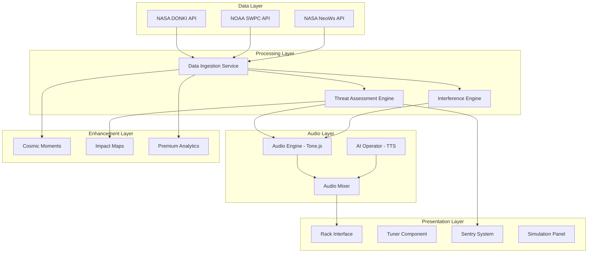

# Design Document: Cosmic Radio Platform

## Overview

The Cosmic Radio Platform is a real-time space weather sonification system that transforms NASA and NOAA telemetry into immersive audio-visual experiences. The platform operates as a "thick client" autonomous engine, generating procedural soundscapes and AI narration in response to cosmic events. The system follows a cassette futurism aesthetic, presenting itself as authentic space monitoring hardware rather than a traditional web application.

The platform addresses three critical enhancement areas: making space weather data feel dangerous through real-world impact visualization, creating viral engagement through shareable cosmic moments, and establishing revenue streams through premium analytical features.

## Architecture

### High-Level System Architecture



### 3-Phase Build Roadmap

#### Phase 1: Core Audio Engine (MVP - Week 1)
**Objective:** Establish the foundational audio-data pipeline

**Components:**
- Data Ingestion Service with NASA/NOAA API integration
- Basic Tone.js audio engine with solar wind BPM mapping
- Simple threat assessment logic
- Minimal UI for audio controls and basic telemetry display

**Success Criteria:** 
- Continuous audio generation based on real space weather data
- Basic threat level visualization
- Stable 60-second polling cycle

#### Phase 2: The "Rack" UI (Full Experience - Week 2)
**Objective:** Complete the immersive hardware interface

**Components:**
- Full Cassette Futurism UI with CRT effects
- Interactive tuning mechanism with physics
- AI Operator with contextual TTS
- Interference simulation engine
- Sentry alert system

**Success Criteria:**
- Complete hardware aesthetic with tactile interactions
- AI narration during significant events
- Realistic radio interference effects

#### Phase 3: "Victor" Pivot Features (Competitive Edge - Week 3)
**Objective:** Implement engagement and monetization features

**Components:**
- Cosmic Moments sharing system
- Real-world impact prediction maps
- Premium analytics dashboard
- Advanced simulation scenarios

**Success Criteria:**
- Viral sharing capability with audio/visual snapshots
- Business model validation through premium feature adoption
- Enhanced user retention through gamification

## Components and Interfaces

### Data Ingestion Service

**Interface:**
```typescript
interface SpaceWeatherData {
  solarWind: {
    speed: number; // km/s
    density: number; // particles/cm³
    timestamp: Date;
  };
  geomagneticActivity: {
    kpIndex: number; // 0-9 scale
    stormLevel: 'quiet' | 'unsettled' | 'storm' | 'severe';
    timestamp: Date;
  };
  solarFlares: {
    class: string; // A, B, C, M, X
    intensity: number;
    timestamp: Date;
    peakTime?: Date;
  }[];
  radioBlackouts: {
    scale: 'R1' | 'R2' | 'R3' | 'R4' | 'R5';
    frequency: string;
    affectedRegions: string[];
    timestamp: Date;
  }[];
}

interface DataIngestionService {
  pollAPIs(): Promise<SpaceWeatherData>;
  validateData(data: unknown): SpaceWeatherData | null;
  getCachedData(): SpaceWeatherData | null;
  onDataUpdate(callback: (data: SpaceWeatherData) => void): void;
}
```

**Implementation Details:**
- Implements exponential backoff for API failures
- Maintains 24-hour rolling cache for offline operation
- Validates JSON schemas before processing
- Emits events for real-time UI updates

### Audio Engine

**Interface:**
```typescript
interface AudioEngine {
  updateSolarWind(speed: number, density: number): void;
  updateGeomagneticActivity(kpIndex: number): void;
  updateInterference(level: InterferenceLevel): void;
  setMasterVolume(volume: number): void;
  mute(): void;
  unmute(): void;
}

type InterferenceLevel = 'none' | 'minor' | 'moderate' | 'severe' | 'blackout';

interface AudioParameters {
  droneFrequency: number; // Base frequency in Hz
  droneBPM: number; // Beats per minute
  distortionAmount: number; // 0-1 scale
  shimmerIntensity: number; // 0-1 scale
  interferenceLevel: InterferenceLevel;
}
```

**Implementation Details:**
- Uses Tone.js for Web Audio API abstraction
- Implements smooth parameter transitions (2-3 second ramps)
- Maintains separate audio contexts for drone, effects, and TTS
- Includes audio ducking for AI operator announcements

### AI Operator System

**Interface:**
```typescript
interface AIOperator {
  generateAnnouncement(event: CosmicEvent): Promise<string>;
  speak(text: string): Promise<void>;
  setVoiceParameters(params: VoiceParams): void;
  isCurrentlySpeaking(): boolean;
}

interface CosmicEvent {
  type: 'solar_flare' | 'geomagnetic_storm' | 'radio_blackout';
  severity: number;
  data: SpaceWeatherData;
  context: string;
}

interface VoiceParams {
  rate: number; // 0.1-10
  pitch: number; // 0-2
  volume: number; // 0-1
  voice: string; // Voice name
}
```

**Implementation Details:**
- Integrates with Web Speech API for TTS
- Implements announcement queuing to prevent overlap
- Uses context-aware prompt engineering for technical accuracy
- Includes fallback to pre-recorded audio for critical announcements

### Threat Assessment Engine

**Interface:**
```typescript
interface ThreatAssessment {
  level: ThreatLevel;
  description: string;
  impacts: RealWorldImpact[];
  recommendations: string[];
  timestamp: Date;
}

type ThreatLevel = 'minimal' | 'minor' | 'moderate' | 'strong' | 'severe' | 'extreme';

interface RealWorldImpact {
  category: 'power_grid' | 'satellites' | 'aviation' | 'radio' | 'gps';
  severity: number; // 1-10 scale
  affectedRegions: GeographicRegion[];
  description: string;
}

interface ThreatAssessmentEngine {
  assessThreat(data: SpaceWeatherData): ThreatAssessment;
  getHistoricalComparison(assessment: ThreatAssessment): HistoricalContext;
  predictImpacts(assessment: ThreatAssessment): RealWorldImpact[];
}
```

**Implementation Details:**
- Uses NOAA space weather scales for standardized threat levels
- Implements machine learning models for impact prediction
- Maintains historical database for comparative analysis
- Generates region-specific impact assessments

## Data Models

### Core Data Structures

```typescript
// Primary data model for space weather state
interface CosmicState {
  id: string;
  timestamp: Date;
  spaceWeather: SpaceWeatherData;
  threatAssessment: ThreatAssessment;
  audioParameters: AudioParameters;
  userInteractions: UserInteraction[];
}

// User interaction tracking
interface UserInteraction {
  type: 'tune' | 'volume_adjust' | 'share' | 'alert_dismiss';
  timestamp: Date;
  parameters: Record<string, unknown>;
  sessionId: string;
}

// Shareable cosmic moments
interface CosmicMoment {
  id: string;
  timestamp: Date;
  event: CosmicEvent;
  audioSnapshot: AudioClip;
  visualSnapshot: ImageData;
  shareUrl: string;
  metadata: {
    threatLevel: ThreatLevel;
    uniqueness: number; // 1-10 scale
    virality: number; // Predicted share potential
  };
}

// Premium analytics data
interface AnalyticsData {
  userId: string;
  sessionDuration: number;
  eventsWitnessed: CosmicEvent[];
  engagementScore: number;
  premiumFeatures: PremiumFeature[];
  subscriptionTier: 'free' | 'explorer' | 'scientist' | 'mission_control';
}
```

### Database Schema

```sql
-- Core tables for data persistence
CREATE TABLE cosmic_states (
  id UUID PRIMARY KEY,
  timestamp TIMESTAMP NOT NULL,
  space_weather_data JSONB NOT NULL,
  threat_assessment JSONB NOT NULL,
  audio_parameters JSONB NOT NULL,
  created_at TIMESTAMP DEFAULT NOW()
);

CREATE TABLE user_sessions (
  id UUID PRIMARY KEY,
  user_id UUID,
  start_time TIMESTAMP NOT NULL,
  end_time TIMESTAMP,
  interactions JSONB[],
  cosmic_moments UUID[],
  engagement_score FLOAT
);

CREATE TABLE cosmic_moments (
  id UUID PRIMARY KEY,
  cosmic_state_id UUID REFERENCES cosmic_states(id),
  audio_clip_url TEXT,
  visual_snapshot_url TEXT,
  share_count INTEGER DEFAULT 0,
  virality_score FLOAT,
  created_at TIMESTAMP DEFAULT NOW()
);

-- Indexes for performance
CREATE INDEX idx_cosmic_states_timestamp ON cosmic_states(timestamp);
CREATE INDEX idx_cosmic_moments_virality ON cosmic_moments(virality_score DESC);
```

## Correctness Properties

*A property is a characteristic or behavior that should hold true across all valid executions of a system—essentially, a formal statement about what the system should do. Properties serve as the bridge between human-readable specifications and machine-verifiable correctness guarantees.*

Now I'll analyze the acceptance criteria to determine which can be tested as properties:
