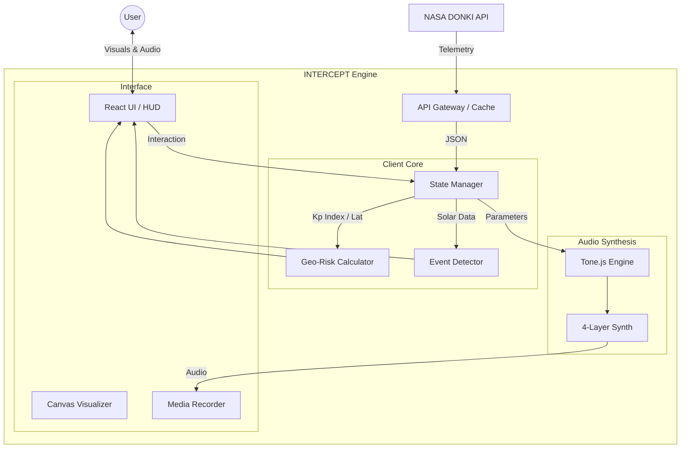

<div align="center">
  
  <h1>INTERCEPT: The Sol-Terrestrial Risk Engine</h1>
  <p>
    <strong>"Space weather is usually silent. It's also expensive."</strong>
  </p>
  <p>
    <a href="#-the-mission">The Mission</a> •
    <a href="#-core-capabilities">Capabilities</a> •
    <a href="#-architecture">Architecture</a> •
    <a href="#-getting-started">Getting Started</a>
  </p>
</div>

---

## 🛰️ The Mission

INTERCEPT is a real-time "Thick Client" receiver that transforms invisible space weather telemetry from NASA and NOAA into a visceral audio-visual experience and a financial risk monitoring system.

Space weather is a multi-billion dollar variable that most organizations treat as a static chart. INTERCEPT wires live solar wind data directly to an economic impact engine, bridging the gap between raw astrophysics and operational reality.

## ⚡ The Challenge

Current space weather monitoring tools are often passive, academic dashboards that fail to communicate the immediate severity of solar events to non-specialists.

*   **The Visibility Gap:** It is difficult to "feel" the mounting risk of a G5 Geomagnetic Storm through a standard data table.
*   **The Economic Gap:** There is a lack of real-time visualization tools that translate K-Index intensity into global grid stress and potential economic impact.

## 🛠️ Core Capabilities

INTERCEPT was developed to move beyond simple data visualization into a functional risk assessment protocol.

1.  **Geo-Risk Analytics:** Real-time calculation of the [NOAA Auroral Oval](https://www.swpc.noaa.gov/) relative to the user's specific geographic coordinates. The system identifies when a user is within the "Critical Risk" zone of the auroral boundary.
2.  **Economic Ticker:** A live estimation engine that calculates **Global Grid Stress ($/hr)** based on geomagnetic intensity.
    *   *Nominal Conditions:* ~$0/hr
    *   *Extreme Events:* Estimated stress exceeding $45,000,000/hr during major storms.
3.  **Integrated Flight Recorder:** A native `.webm` capture system using the MediaRecorder API to document telemetry anomalies as they occur, providing verifiable visual evidence of signal drift and solar events.
4.  **Temporal Archives:** Access to historical super-storm telemetry (such as the 2003 "Halloween Event") is restricted to specific temporal windows, ensuring the focus remains on the rare and significant nature of extreme solar phenomena.

## 🧠 System Architecture

Developed with a focus on high-frequency telemetry processing and procedural audio synthesis.



| Layer | Technology | Function |
| :--- | :--- | :--- |
| **Interface** | React / Tailwind CSS | High-contrast HUD / "Cassette Futurism" aesthetic |
| **Audio Engine** | Tone.js | 4-Layer procedural synthesis (Telemetry sonification) |
| **State Management** | Zustand | High-frequency telemetry store (60fps reactive updates) |
| **Visualization** | Canvas API | Real-time waveform rendering and particle dynamics |
| **Data Ingress** | NASA DONKI API | Live Solar Flare (FLR) and Geomagnetic (GST) feeds |

## 🚀 Getting Started

**Prerequisites:** Node.js v18+

1.  **Install Dependencies:**
    ```bash
    npm install
    ```

2.  **Initialize System:**
    ```bash
    npm run dev
    ```

3.  **Calibration:**
    *   Access the interface via `http://localhost:3000`.
    *   **Note:** You must grant Microphone/Audio permissions to allow the procedural audio engine to initialize.

---

### 📂 Project Evolution
*   [View Architectural Evidence](./kiro) - Documentation regarding the transition from concept to risk engine.

---

*Submitted for the AWS <> Devfolio Hackathon (Kiro Track).*