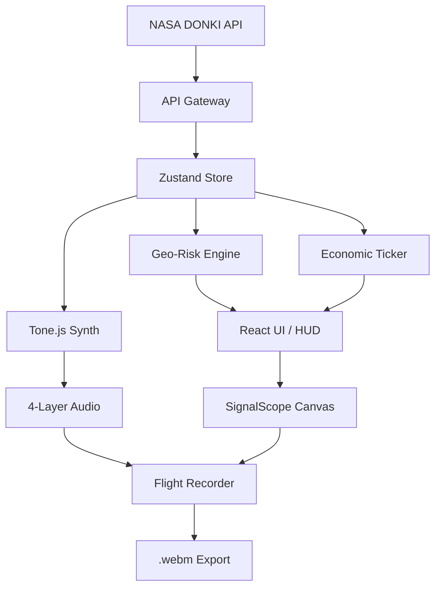

# INTERCEPT: Sol-Terrestrial Risk Engine
**AWS × Devfolio Hackathon Submission (Kiro Track)**

---

> **"Space weather is usually silent. It's also expensive."**

---

## 1. Problem Statement

Space weather is one of civilization's most under-appreciated systemic risks. The Sun bombards Earth with charged particles, and during extreme events like Coronal Mass Ejections (CMEs), the damage potential is catastrophic.

**The Stakes:**
- **1989 Quebec Blackout:** 6 million without power; $2B damages
- **1859 Carrington Event (if repeated today):** $1-2 Trillion USD in global infrastructure damage (Lloyds of London)

**The Gap:** Current tools like NASA's DONKI are passive dashboards—static data tables that fail to communicate urgency. Users cannot "feel" the mounting risk of a G5 Geomagnetic Storm through a spreadsheet. There is a critical **"Sensory Gap"** between astrophysics and operational reality.

---

## 2. Solution Overview

**INTERCEPT is not a dashboard. It is a "Thick Client" Sol-Terrestrial Risk Engine.**

We bridge the sensory gap by treating solar telemetry not as data to be *read*, but as a signal to be *heard and felt*.

| Design Principle | Implementation |
|:---|:---|
| **Interface as Hardware** | "Cassette Futurism" aesthetic—CRT monitors, analog consoles |
| **Procedural Audio** | `Tone.js` synthesizes audio in real-time from live solar wind data |
| **Active Engagement** | Users must "tune" the receiver to combat ionospheric drift |

---

## 3. Technologies Used

| Layer | Technology | Purpose |
|:---|:---|:---|
| **Framework** | Next.js 14, TypeScript | SSR, API routes, type safety |
| **Styling** | Tailwind CSS | Custom "Rack" grid layout |
| **State** | Zustand | High-frequency store (60fps updates) |
| **Audio** | Tone.js | Procedural synthesis engine |
| **Video** | MediaRecorder API | Native .webm export |
| **Planning** | Kiro IDE | Architecture mapping & pivot execution |
| **Data** | NASA DONKI API | Solar Flares (FLR), Geomagnetic Storms (GST) |

---

## 4. System Architecture



**Flow:** NASA telemetry → Zustand state → Risk/Audio calculations → Real-time UI + Video capture

---

## 5. Key Features: The "Victor Protocol"

After initial feedback that the project was "a toy," we executed a pivot to **Gamify, Financialize, and Viralize** the experience.

### I. Geo-Risk Engine
Real-time risk calculation using the **NOAA Auroral Oval Equatorward Boundary** formula:

$$\text{Auroral Boundary} = 66.5° - (K_p \times 2.8°)$$

At Kp 9, the auroral boundary drops to **41.3° N**—threatening New York, Rome, and Beijing.

| Status | Condition | Visual |
|:---|:---|:---|
| **CRITICAL** | Inside Auroral Oval | 🔴 Red Alert |
| **WARNING** | Within 5° of boundary | 🟠 Amber |
| **NOMINAL** | Safely below horizon | 🟢 Green |

### II. Economic Ticker
Translates Kp Index into **estimated hourly grid stress ($/hr)**:

$$\text{Hourly Cost} = K_p^6 \times 86$$

| Kp Index | Estimated Impact |
|:---:|---:|
| Kp 5 | ~$1.3M/hr |
| Kp 7 | ~$10.1M/hr |
| Kp 9 | ~$45.7M/hr |

### III. Flight Recorder
Native `.webm` video capture using `canvas.captureStream()` + `Tone.context.createMediaStreamDestination()`. Auto-downloads `intercept_log_[timestamp].webm` after 15-second capture.

### IV. Time-Locked Archive
"Super-Storm Simulation" (Carrington Event) locked to **18:00-19:00 Local Time** daily. Creates scarcity and prevents "crying wolf." Dev override: `?debug=true`.

### V. Mars Uplink (SaaS Demo)
Simulated paywall for "Mars Curiosity Telemetry" ($4.99/mo). Demonstrates business model viability. On "subscription," Mars atmospheric data replaces Earth telemetry.

---

## 6. Challenges & Learnings

### The Pivot (Kiro-Powered)
INTERCEPT began as **"Cosmic Radio"**—an ambient "Lo-Fi space weather music" concept. Early feedback: *"It's a toy. No 'So What?'"*

Using **Kiro IDE**, we executed a rapid pivot:
1. **Re-framed** the problem from "ambient experience" to "risk communication tool"
2. **Spec'd** the "Victor Protocol" features in Kiro's task system
3. **Mapped** the new architecture without rewriting the Tone.js engine

Evidence preserved in `.kiro/evidence/` directory.

### The Audio/Video Sync Challenge
Synchronizing Tone.js audio with Canvas video for the Flight Recorder required bridging two different Web APIs:

```typescript
// Merge audio + video streams
const videoStream = canvas.captureStream(30);
const audioDestination = Tone.context.createMediaStreamDestination();
videoStream.addTrack(audioDestination.stream.getAudioTracks()[0]);
const recorder = new MediaRecorder(videoStream);
```

---

## 7. Getting Started

```bash
# Install
npm install

# Run
npm run dev

# Access
http://localhost:3000
```

**First-Time Setup:**
- Grant **Audio permissions** (required for Tone.js)
- Grant **Location** (optional, for Geo-Risk calculation)
- **Tune the receiver** to lock onto 1420 MHz

---

## 8. Project Evidence

| File | Description |
|:---|:---|
| `.kiro/evidence/01_ideation.png` | Initial concept |
| `.kiro/evidence/03_victor_pivot.png` | The pivot decision |
| `.kiro/evidence/Old legacy UI.png` | Original "Cosmic Radio" UI |
| `.kiro/evidence/06_FullUI.png` | Final INTERCEPT interface |

---

<div align="center">

**INTERCEPT: Sol-Terrestrial Risk Engine**

*AWS × Devfolio Hackathon (Kiro Track)*

*"The Sun is always broadcasting. Now, you can listen."*

</div>
